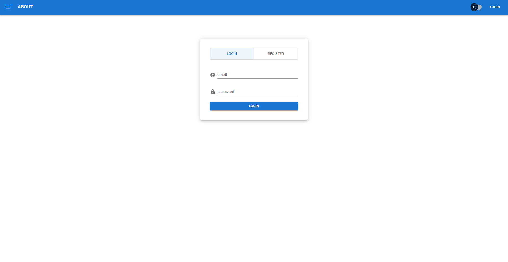

# TODO-react

Список задач с регистрацией и входом: авторизация по токену, добавление,
редактирование и удаление задач, переключение светлой и тёмной темы.

**[Открыть демо →](https://alonaborealis.github.io/todo-react/)**



## Стек

- React, TypeScript, Vite
- MUI для интерфейса
- Zustand для состояния списка задач
- axios для запросов к API, JWT для авторизации
- ESLint, Prettier

## Как устроено

Код разложен по слоям в духе Feature-Sliced Design:

```
src/
  app/       точка входа, тема, шапка приложения
  entities/  сущности предметной области
    Todo/    модель, хранилище, компоненты списка
    User/    модель пользователя, форма входа и регистрации
  shared/    общий код: клиент API, автологин
```

Состояние списка задач вынесено в отдельное хранилище на Zustand с
подключённым `devtools` — изменения видны в расширении Redux DevTools.

Токен кладётся в `localStorage`, при загрузке страницы автологин
разбирает его и сверяет срок годности: просроченный токен удаляется,
и пользователь возвращается к форме входа.

Ошибки от сервера типизированы через `AxiosError` и показываются
уведомлениями, а не в консоли.

## Разработка

```
npm install
npm run dev
```

## Сборка и публикация

Собранная версия публикуется на GitHub Pages автоматически при пуше
в `main` — сборкой занимается workflow `.github/workflows/deploy.yml`.

Проект отдаётся из подпапки `/todo-react/`, поэтому в `vite.config.ts`
задан `base` — без него пути к собранным файлам ведут в корень домена.

## Демо-режим

Приложение писалось под учебный API, который отключили вместе с курсом,
поэтому вход и регистрация не срабатывают. Код работы с сервером остался
на месте — axios, разбор JWT, проверка срока годности токена, — но на
экране входа добавлена кнопка «Войти в демо-режиме»: она пускает внутрь
напрямую.

Список задач от сервера не зависит и работает целиком на своём хранилище,
так что в демо доступно всё: добавление, редактирование, удаление,
отметка о выполнении и переключение темы. Состояние живёт в памяти
вкладки и сбрасывается при перезагрузке.
